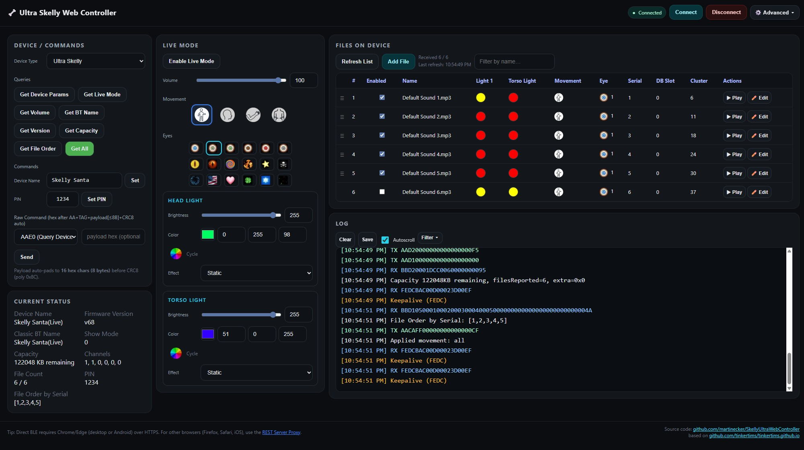

# Skelly Ultra Web Controller

A modern web-based Bluetooth controller for Home Depot's 6.5 ft Skelly Ultra animatronic skeleton. Control lights, sounds, animations, and file management directly from your browser using Web Bluetooth API.

## ✨ Features

### 🎵 Audio File Management
- **Upload Audio Files**: Send MP3 and other audio files directly to your Skelly via Bluetooth
- **Automatic Conversion**: Built-in audio conversion to optimize files for the device (8kHz, mono, 32kbps MP3)
- **File List Management**: View, play, pause, and delete files stored on the device
- **Storage Monitoring**: Check available storage capacity in real-time
- **Edit File Metadata**: Modify file properties including lights, animations, and eye icons

### 💡 Lighting Control
- **Dual Zone Control**: Separate control for head and torso lights
- **RGB Color Picker**: Choose any color for head and torso lights independently
- **Brightness Control**: Adjust brightness from 0-255 for each zone
- **Effect Modes**: 
  - Static: Solid color
  - Strobe: Flashing effect with adjustable speed
  - Pulsing: Breathing effect with adjustable speed
- **Color Cycling**: Enable rainbow color cycling mode
- **Effect Speed**: Fine-tune strobe and pulsing speeds (0-255)

### 🎭 Appearance & Animation
- **Eye Icons**: Choose from multiple eye designs to display on the device
- **Movement Control**: Enable/disable movement animations for:
  - Head movements
  - Arm movements
  - Torso movements
  - All movements (combined control)

### 🎮 Live Mode Controls
- **Classic Bluetooth Audio**: Enable live mode to stream audio from your phone via Bluetooth
- **Real-time Adjustments**: Change lights, colors, effects, and animations on-the-fly
- **Volume Control**: Adjust playback volume (0-255)
- **Quick Eye Selection**: Fast access to eye icon switching during live mode
- **Device Status**: Monitor connection state and device parameters

### 📡 Device Management
- **Web Bluetooth Connection**: No drivers or apps required—connect directly from Chrome, Edge, or compatible browsers
- **Device Information**: View firmware version, Bluetooth name, and device parameters
- **Query Commands**: Access advanced device queries for troubleshooting
- **Connection Status**: Visual indicators for connection state and signal strength

### 🔧 Advanced Features
- **Raw Command Mode**: Send custom protocol commands for advanced users
- **Detailed Logging**: View all Bluetooth communication (TX/RX) in real-time
- **Progress Tracking**: Monitor file transfer progress with visual indicators
- **File Edit Dialog**: Comprehensive file editing interface with preview

## 🌐 Browser Compatibility

This controller requires a browser with Web Bluetooth API support:
- ✅ Chrome/Chromium
- ✅ Microsoft Edge
- ✅ Opera
- ❌ Firefox (Web Bluetooth not supported)
- ❌ Safari (Web Bluetooth not supported)

## 🚀 Getting Started

1. **Open the Controller**: Load `index.html` in a compatible browser
2. **Accept the Warning**: Read and accept the risk acknowledgment
3. **Connect Your Device**: Click "Connect" and select your Skelly from the Bluetooth device list
4. **Start Controlling**: Upload files, adjust lights, and control your Skelly!

## ⚠️ Important Notes

- **Keep Browser Tab Active**: File transfers require the browser tab to remain in focus
- **Stable Power**: Ensure your Skelly remains powered on during file transfers
- **Transfer Speed**: Large files may take several minutes to upload and process

## 🛠️ Technical Details

### Architecture
- **Modular JavaScript**: ES6 modules for clean code organization
- **State Management**: Centralized state management for device status and UI updates
- **Protocol Parser**: Custom protocol implementation for Skelly communication
- **Audio Processing**: Client-side MP3 encoding using LameJS library

### Key Modules
- `ble-manager.js`: Handles all Bluetooth Low Energy communication
- `file-manager.js`: Manages file transfers and audio conversion
- `state-manager.js`: Centralized application state
- `protocol-parser.js`: Protocol parsing and command building
- `edit-modal.js`: File editing interface logic

## 🔐 Safety

This tool communicates directly with your device's Bluetooth interface. While tested, there is **no guarantee** against potential device issues. Always:
- Avoid power interruptions during transfers
- Keep backups of important files
- Proceed at your own risk

---

**Note**: This is an unofficial community tool and is not affiliated with or endorsed by the manufacturer of Skelly Ultra.
